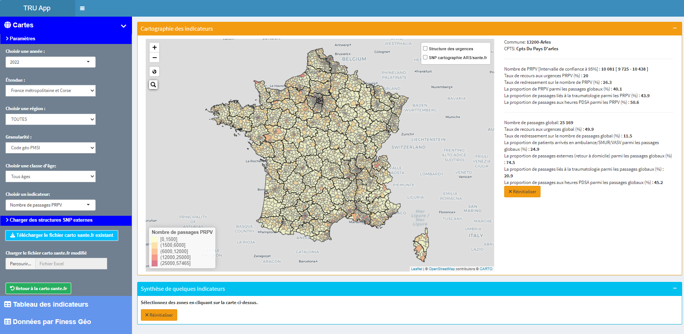
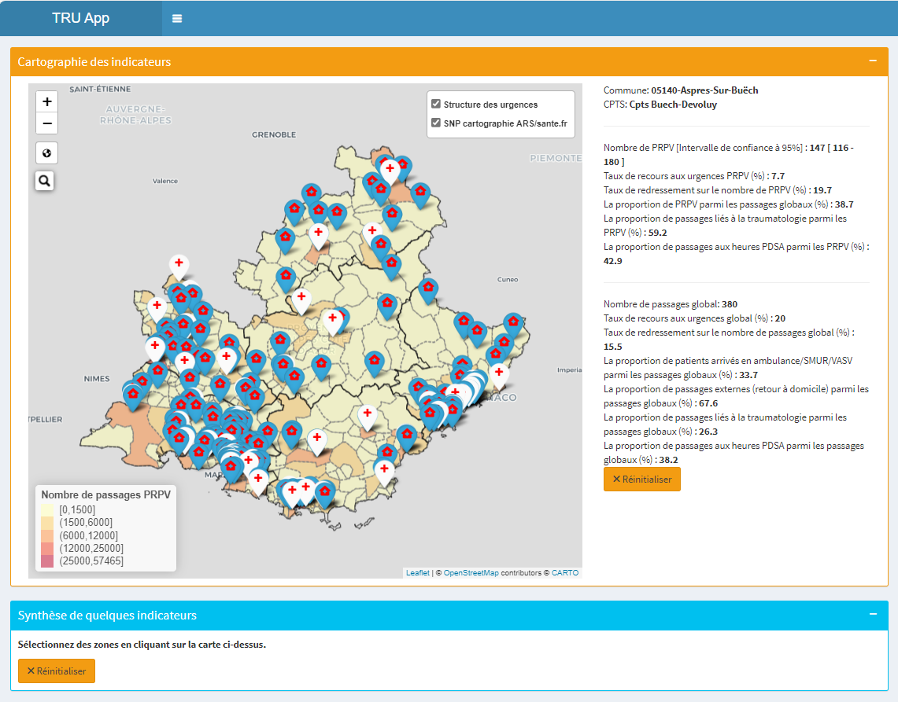

# Projet : Dashboard interactif pour la visualisation des indicateurs de santé

## Période:

-   2023-2024

## Technologies utilisées

-   R, Shiny, Leaflet, dplyr, ggplot2, Git

## Mon rôle

-   Conception des indicateurs, développement et déploiement de l'application Shiny, intégration des données géospatiales.

## Contexte

Le pacte de refondation des urgences de 2019 a pour objectif principal de recentrer l’activité des structures de médecine d’urgence sur leur cœur de métier et d’en améliorer le fonctionnement. Sa mise en œuvre a été retardée par la pandémie de covid en 2020-2021. Ce pacte correspond à une stratégie globale, dont les mesures portent sur l’amont et l’aval des urgences, ainsi que sur le fonctionnement de ces structures.

Enfin en avril 2023 le Président de la République a annoncé l’objectif de désengorger les structures des urgences à horizon fin 2024. Dans ce contexte, la DGOS a lancé en 2021 des travaux d’outillage des ARS (Agences Régionales de Santé), portés le plus souvent par des ARS pilotes volontaires. L'agence régionale de santé du provence d'alpe-côte d'azur pilote le projet TRU.

## Objectif

Le projet TRU vise à identifier les zones où le développement de l'offre de soins non programmés pourrait réduire le recours aux urgences, avec comme objectif la création d'une application cartographique interactive (outil TRU) pour les ARS.

## Résultats

-   Conception et développement réussis d'une application cartographique interactive appelée outil TRU, qui est destinée aux Agences Régionales de Santé. Cette application aide à optimiser la gestion des soins non programmés, contribuant ainsi à la réduction de la congestion des services d'urgence;
-   Création d'indicateurs de qualité cruciaux pour les ARS, permettant une prise de décision plus éclairée et une amélioration de l'efficacité des services de santé.

## Fonctionnalités

L'outil comprend 3 onglets qui sont:

-   Cartes est l'onglet principal de l'outil qu'est la cartographie des indicateurs;
-   Tableau des indicateurs contient un tableau d'indicateurs par commune;
-   Données par Finess Géo contient un tableau d'indicateurs par service d'urgence;
-   Lisez-moi contient un glossaire et des liens vers le document de méthodologie de calcul des indicateurs et le dictionnaire des variables.

